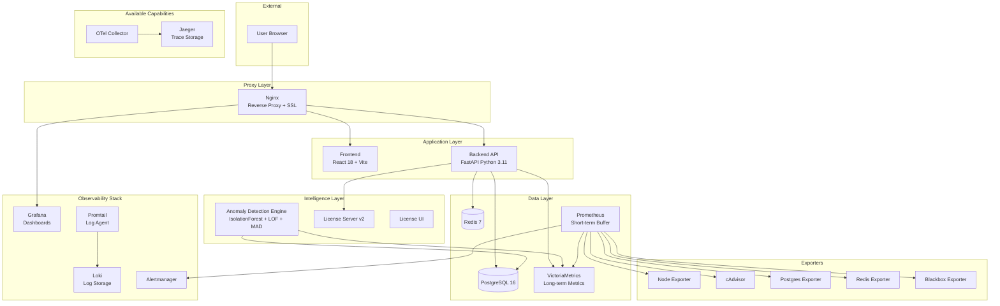
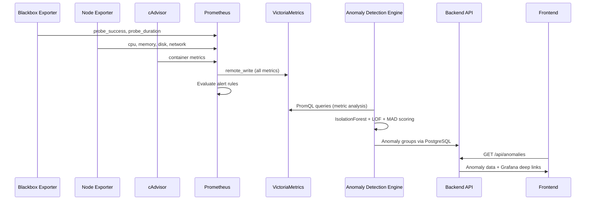
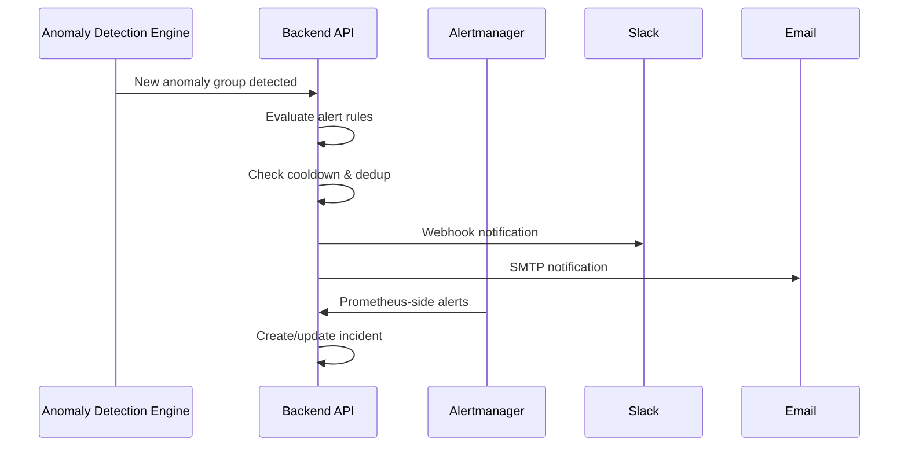
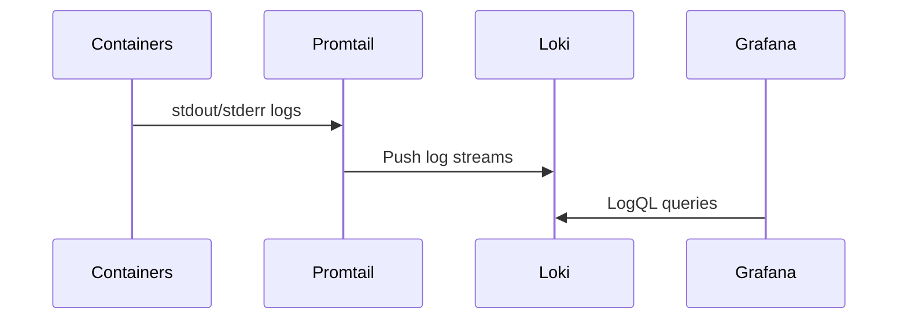

# Rhinometric — Architecture

**Version:** 2.7.0
**Maintained by:** Rhinometric Team — info@rhinometric.com

---

## System Architecture

Rhinometric is deployed as a containerized stack of 21 Docker services organized in distinct layers. All inter-service communication occurs over a shared Docker network with Nginx as the single external entry point.

### High-Level Architecture

---

## Container Inventory

| # | Service | Technology | Port | Purpose |
|---|---------|-----------|------|---------|
| 1 | nginx | Nginx 1.25 | 80, 443 | Reverse proxy, SSL termination, static file serving |
| 2 | frontend | React 18 + Vite | 3000 | Single-page application |
| 3 | backend | FastAPI + Python 3.11 | 8105 | REST API, business logic, data access |
| 4 | postgres | PostgreSQL 16 | 5432 | Primary database for all application state |
| 5 | redis | Redis 7 | 6379 | Caching, session data, real-time pub/sub |
| 6 | prometheus | Prometheus | 9090 | Short-term metric buffer (30-day retention) |
| 7 | victoriametrics | VictoriaMetrics | 8428 | Long-term metric storage (90-day retention) |
| 8 | loki | Grafana Loki | 3100 | Log aggregation and query engine |
| 9 | jaeger | Jaeger | 16686 | Distributed tracing (available — requires app instrumentation) |
| 10 | grafana | Grafana | 3001 | Metric visualization and dashboards |
| 11 | alertmanager | Alertmanager | 9093 | Alert routing and deduplication |
| 12 | otel-collector | OpenTelemetry Collector | 4317, 4318 | Telemetry pipeline (traces) |
| 13 | node-exporter | Prometheus Node Exporter | 9100 | System-level metrics (CPU, memory, disk, network) |
| 14 | cadvisor | Google cAdvisor | 8080 | Container resource usage metrics |
| 15 | postgres-exporter | Prometheus PG Exporter | 9187 | PostgreSQL performance metrics |
| 16 | redis-exporter | Prometheus Redis Exporter | 9121 | Redis performance metrics |
| 17 | blackbox-exporter | Prometheus Blackbox Exporter | 9115 | Service endpoint probe checks |
| 18 | promtail | Grafana Promtail | — | Log collection agent |
| 19 | ai-anomaly | Custom | 8085 | Anomaly detection engine (IsolationForest, LOF, MAD) |
| 20 | license-server-v2 | Custom Python | 8200 | License key validation |
| 21 | license-ui | React | 8201 | License management interface |

---

## Data Flow

### Metric Collection & Anomaly Detection Flow

### Alert & Notification Flow

### Log Collection Flow

> **Note:** Distributed tracing via Jaeger/OpenTelemetry is available when applications are instrumented with OTel SDKs. The infrastructure (OTel Collector → Jaeger) is deployed and ready. Currently, only the Rhinometric backend itself emits traces.

---

## Network Architecture

All services communicate over a shared Docker bridge network. Only Nginx is exposed to the external network.

| External Port | Internal Service | Protocol |
|--------------|-----------------|----------|
| 80 | nginx | HTTP (redirect to 443) |
| 443 | nginx | HTTPS |

All other services are accessible only via the Docker internal network, with Nginx proxying requests based on URL path:
- `/` → Frontend
- `/api/` → Backend
- `/grafana/` → Grafana

---

## Security Architecture

- **TLS Termination**: Nginx handles SSL with Let's Encrypt certificates.
- **Authentication**: JWT-based with bcrypt password hashing.
- **Authorization**: Role-based access control with 4 roles enforced at API and UI levels.
- **CORS**: Restricted to configured frontend origin.
- **Rate Limiting**: Applied to authentication endpoints.
- **Secret Management**: Environment variables via `.env` file (vault integration planned).
- **Network Isolation**: Only Nginx is externally exposed.

---

## Scalability Considerations

The current architecture is designed for single-node deployment. For production scale-out:

| Component | Scaling Strategy |
|-----------|-----------------|
| Backend API | Horizontal — multiple containers behind Nginx load balancing |
| PostgreSQL | Vertical scaling or read replicas |
| VictoriaMetrics | Native clustering support available |
| Prometheus | Federation or Thanos for multi-node |
| Anomaly Detection | Horizontal — shard by service groups |

---

*Copyright 2024–2026 Rhinometric. All rights reserved.*
