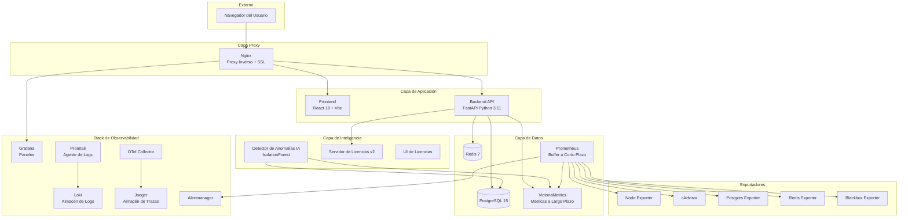
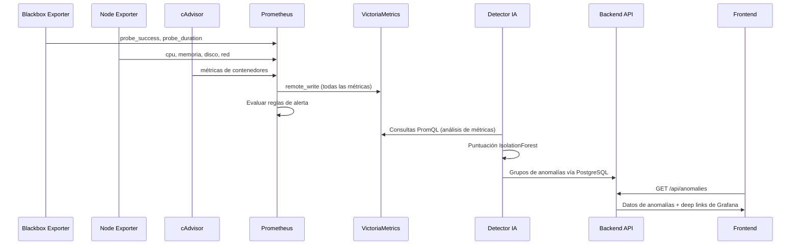
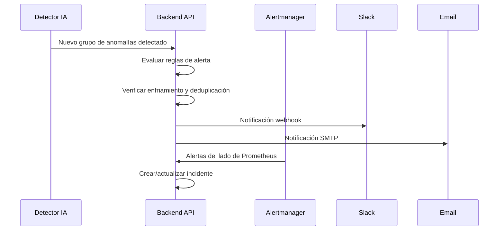
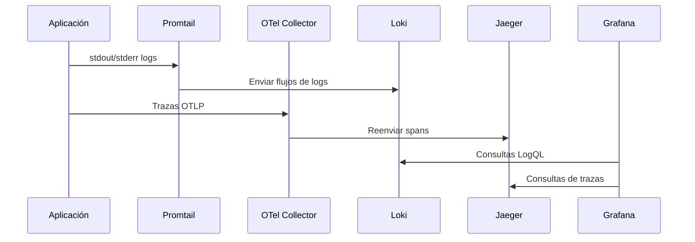

# Rhinometric — Arquitectura

**Versión:** 2.7.0  
**Mantenido por:** Rhinometric Team — info@rhinometric.com

---

## Arquitectura del Sistema

Rhinometric se despliega como un stack contenedorizado de 21 servicios Docker organizados en capas diferenciadas. Toda la comunicación entre servicios ocurre sobre una red Docker compartida, con Nginx como único punto de entrada externo.

### Arquitectura de Alto Nivel

---

## Inventario de Contenedores

| # | Servicio | Tecnología | Puerto | Propósito |
|---|---------|-----------|--------|-----------|
| 1 | nginx | Nginx 1.25 | 80, 443 | Proxy inverso, terminación SSL, servicio de archivos estáticos |
| 2 | frontend | React 18 + Vite | 3000 | Aplicación de página única |
| 3 | backend | FastAPI + Python 3.11 | 8105 | API REST, lógica de negocio, acceso a datos |
| 4 | postgres | PostgreSQL 15 | 5432 | Base de datos principal para todo el estado de la aplicación |
| 5 | redis | Redis 7 | 6379 | Caché, datos de sesión, pub/sub en tiempo real |
| 6 | prometheus | Prometheus | 9090 | Buffer de métricas a corto plazo (retención 15 días) |
| 7 | victoriametrics | VictoriaMetrics | 8428 | Almacenamiento de métricas a largo plazo (retención 1 año) |
| 8 | loki | Grafana Loki | 3100 | Agregación y motor de consulta de logs |
| 9 | jaeger | Jaeger | 16686 | Recolección y consulta de trazas distribuidas |
| 10 | grafana | Grafana | 3001 | Visualización de métricas y paneles |
| 11 | alertmanager | Alertmanager | 9093 | Enrutamiento y deduplicación de alertas |
| 12 | otel-collector | OpenTelemetry Collector | 4317, 4318 | Pipeline de telemetría (trazas, métricas) |
| 13 | node-exporter | Prometheus Node Exporter | 9100 | Métricas del host (CPU, memoria, disco, red) |
| 14 | cadvisor | Google cAdvisor | 8080 | Métricas de uso de recursos de contenedores |
| 15 | postgres-exporter | Prometheus PG Exporter | 9187 | Métricas de rendimiento de PostgreSQL |
| 16 | redis-exporter | Prometheus Redis Exporter | 9121 | Métricas de rendimiento de Redis |
| 17 | blackbox-exporter | Prometheus Blackbox Exporter | 9115 | Verificaciones de sondeo de endpoints |
| 18 | promtail | Grafana Promtail | — | Agente de recolección de logs |
| 19 | ai-anomaly | Python Personalizado | 8110 | Motor de detección de anomalías IA |
| 20 | license-server-v2 | Python Personalizado | 8200 | Validación de llaves de licencia |
| 21 | license-ui | React | 8201 | Interfaz de gestión de licencias |

---

## Flujo de Datos

### Flujo de Recolección de Métricas

### Flujo de Alertas y Notificaciones

### Flujo de Logs y Trazas

---

## Arquitectura de Red

Todos los servicios se comunican sobre una red bridge Docker compartida. Solo Nginx está expuesto a la red externa.

| Puerto Externo | Servicio Interno | Protocolo |
|----------------|-----------------|-----------|
| 80 | nginx | HTTP (redirige a 443) |
| 443 | nginx | HTTPS |

Todos los demás servicios son accesibles solo a través de la red interna Docker, con Nginx redireccionando solicitudes basado en la ruta URL:
- `/` → Frontend
- `/api/` → Backend
- `/grafana/` → Grafana

---

## Arquitectura de Seguridad

- **Terminación TLS**: Nginx maneja SSL con certificados Let's Encrypt.
- **Autenticación**: Basada en JWT con hash bcrypt para contraseñas.
- **Autorización**: Control de acceso basado en roles con 4 roles aplicados a nivel de API e interfaz.
- **CORS**: Restringido al origen del frontend configurado.
- **Limitación de Tasa**: Aplicada a endpoints de autenticación.
- **Gestión de Secretos**: Variables de entorno vía archivo `.env` (integración con vault planificada).
- **Aislamiento de Red**: Solo Nginx está expuesto externamente.

---

## Consideraciones de Escalabilidad

La arquitectura actual está diseñada para despliegue en un solo nodo. Para escalamiento en producción:

| Componente | Estrategia de Escalamiento |
|-----------|---------------------------|
| Backend API | Horizontal — múltiples contenedores detrás de balanceo Nginx |
| PostgreSQL | Escalamiento vertical o réplicas de lectura |
| VictoriaMetrics | Soporte nativo de clustering disponible |
| Prometheus | Federación o Thanos para múltiples nodos |
| Detector IA | Horizontal — particionamiento por grupos de servicios |

---

*Copyright 2024–2026 Rhinometric. Todos los derechos reservados.*
