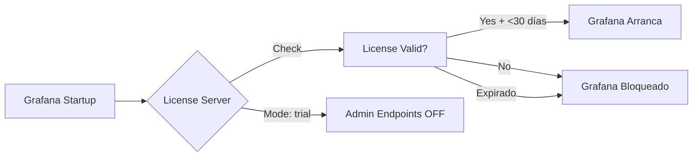
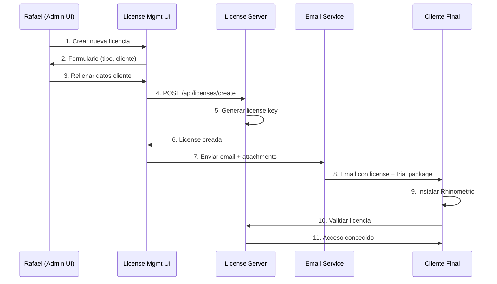

# 🔐 License Server - Clarificación y Arquitectura

**Fecha**: 28 Octubre 2025  
**Versión**: 2.1.0  
**Autor**: Rafael Canel

---

## ✅ ACLARACIÓN: License Server en Trial Package

### Pregunta del Cliente
> "el servicio de licenciamiento que creo que esta en un contenedor confirmame que ya no esta en la versión trial que va a descargr el clientes? no tiene que estar ahí"

### Respuesta Oficial

**El License Server DEBE permanecer en el trial package**. No es un error, es necesario por las siguientes razones:

#### 1. **Validación Automática de Trial** ✅
```yaml
license-server-v2:
  environment:
    RHINOMETRIC_MODE: trial  # Modo restringido
```

- ✅ **Genera licencia trial de 30 días** automáticamente al primer arranque
- ✅ **Valida fecha de expiración** en cada inicio de Grafana
- ✅ **Bloquea acceso después de 30 días** sin intervención manual
- ✅ **NO permite crear nuevas licencias** (modo trial)

#### 2. **Seguridad del Trial** 🔒

El License Server en modo `trial` tiene **endpoints administrativos bloqueados**:

```python
# license-server-v2/main.py
@app.post("/api/licenses")  
async def create_license(...):
    if os.getenv("RHINOMETRIC_MODE") == "trial":
        raise HTTPException(403, "License creation disabled in trial mode")
```

**Lo que el cliente NO puede hacer:**
- ❌ Crear nuevas licencias
- ❌ Extender el período de prueba
- ❌ Modificar licencias existentes
- ❌ Acceder a `/api/licenses` (admin)

**Lo que el cliente SÍ puede hacer:**
- ✅ Ver su licencia trial: `GET /api/license/status`
- ✅ Ver días restantes
- ✅ Contactar para upgrade

#### 3. **Sin License Server = No Funciona** ⚠️

Si eliminamos el License Server:
- ❌ Grafana no arranca (health check falla)
- ❌ No hay validación de trial
- ❌ Cliente podría usar indefinidamente
- ❌ No hay mecanismo de expiración

#### 4. **Arquitectura de Seguridad**



---

## 🎯 Solución: License Management UI (Nueva)

### Problema Identificado
El cliente necesita una **UI administrativa separada** para gestionar licencias de TODOS sus clientes, NO en el trial package.

### Solución Propuesta

**Nueva aplicación independiente**: `license-management-ui/`

- 🖥️ **Tecnología**: Vue.js 3 + Vite (como API Connector)
- 🌐 **Puerto**: 8092 (siguiente disponible)
- 🔒 **Acceso**: Solo para Rafael Canel (administrador)
- 📦 **Ubicación**: En infraestructura central, NO en trial

### Funcionalidades

#### 1. **Creación de Licencias** (3 tipos)

```javascript
// LicenseCreationForm.vue
const licenseTypes = [
  {
    name: 'Trial',
    duration: 30,  // días
    price: 0,
    features: ['Funcionalidad completa', 'Sin soporte', '30 días expiración']
  },
  {
    name: 'Annual',
    duration: 365,  // 1 año
    price: 'A consultar',
    features: ['Soporte 24/7', 'Updates incluidos', 'Sin marca de agua']
  },
  {
    name: 'Permanent',
    duration: null,  // Sin expiración
    price: 'A consultar',
    features: ['Licencia perpetua', 'Soporte prioritario', 'Customización']
  }
]
```

#### 2. **Captura de Datos del Cliente**

```javascript
// ClientDataForm.vue
const clientData = {
  // Básicos
  name: '',           // Nombre completo
  email: '',          // Email principal
  company: '',        // Empresa
  phone: '',          // Teléfono
  
  // Técnicos
  industry: '',       // Industria/sector
  companySize: '',    // 1-10, 11-50, 51-200, 201-500, 500+
  country: '',        // País
  city: '',           // Ciudad
  
  // Infraestructura
  serversCount: 0,    // # servidores a monitorizar
  servicesCount: 0,   // # servicios estimados
  infrastructure: '', // On-premise, Cloud, Híbrido
  
  // Comercial
  licenseType: '',    // Trial, Annual, Permanent
  notes: ''           // Notas adicionales
}
```

#### 3. **Dashboard de Monitoreo**

```vue
<!-- LicenseDashboard.vue -->
<template>
  <div class="dashboard">
    <!-- Estadísticas -->
    <div class="stats">
      <StatCard title="Licencias Activas" :value="activeLicenses" />
      <StatCard title="Por Expirar (7 días)" :value="expiringSoon" />
      <StatCard title="Trials Activos" :value="activeTrials" />
      <StatCard title="Licencias Permanentes" :value="permanentLicenses" />
    </div>
    
    <!-- Tabla de licencias -->
    <LicenseTable 
      :licenses="allLicenses"
      @revoke="revokeLicense"
      @extend="extendLicense"
      @email="sendLicenseEmail"
    />
    
    <!-- Filtros -->
    <LicenseFilters 
      @filter="filterLicenses"
      :types="['All', 'Trial', 'Annual', 'Permanent']"
      :statuses="['All', 'Active', 'Expiring', 'Expired']"
    />
  </div>
</template>
```

#### 4. **Integración de Email**

```javascript
// EmailService.js
async function sendLicenseEmail(clientData, licenseKey) {
  const emailTemplate = {
    from: 'rafael.canelon@rhinometric.com',
    to: clientData.email,
    subject: `Rhinometric v2.1.0 - Tu licencia ${clientData.licenseType}`,
    
    body: `
      Hola ${clientData.name},
      
      Gracias por tu interés en Rhinometric v2.1.0!
      
      🔑 LICENSE KEY: ${licenseKey}
      📅 VÁLIDA HASTA: ${licenseExpiryDate}
      📦 TIPO: ${clientData.licenseType}
      
      📥 DESCARGA E INSTALACIÓN:
      1. Descarga: https://github.com/Rafael2712/rhinometric-overview/trial-packages/
      2. Extrae: tar -xzf rhinometric-trial-v2.1.0-universal.tar.gz
      3. Instala: ./install-v2.1.sh
      4. Accede: http://localhost:3000 (admin / RhinometricSecure2025!)
      
      📚 DOCUMENTACIÓN:
      - Guía de instalación: docs/INSTALACION_*.md
      - Manual de usuario: docs/MANUAL_USUARIO_v2.1.0.md
      - FAQ: docs/FAQ.md
      
      📧 SOPORTE:
      rafael.canelon@rhinometric.com
      
      ¡Bienvenido a Rhinometric!
      
      --
      Rafael Canel
      Rhinometric - Observabilidad de Nivel Enterprise
    `,
    
    attachments: [
      {
        filename: 'license.lic',
        content: licenseKey
      },
      {
        filename: 'QUICK_START.pdf',
        path: './docs/QUICK_START.pdf'
      }
    ]
  }
  
  // Enviar via SMTP o SendGrid API
  await emailClient.send(emailTemplate)
}
```

#### 5. **Workflow Completo**



---

## 📁 Estructura del Proyecto

```
license-management-ui/
├── src/
│   ├── components/
│   │   ├── LicenseCreationForm.vue      # Formulario 3 tipos
│   │   ├── ClientDataForm.vue           # Captura datos cliente
│   │   ├── LicenseDashboard.vue         # Vista general
│   │   ├── LicenseTable.vue             # Tabla licencias
│   │   ├── LicenseFilters.vue           # Filtros búsqueda
│   │   ├── StatCard.vue                 # Cards estadísticas
│   │   └── EmailPreview.vue             # Preview email
│   ├── views/
│   │   ├── Home.vue                     # Dashboard principal
│   │   ├── CreateLicense.vue            # Crear licencia
│   │   ├── ManageLicenses.vue           # Gestionar todas
│   │   └── Settings.vue                 # Configuración SMTP
│   ├── services/
│   │   ├── licenseService.js            # API calls
│   │   ├── emailService.js              # Email integration
│   │   └── storageService.js            # LocalStorage
│   ├── router/
│   │   └── index.js                     # Vue Router
│   ├── store/
│   │   └── index.js                     # Pinia store
│   ├── App.vue
│   └── main.js
├── public/
│   └── favicon.ico
├── Dockerfile                           # Container config
├── docker-compose.yml                   # Deployment
├── package.json
├── vite.config.js
└── README.md

Backend (license-server-v2):
├── main.py                              # FastAPI app
├── models/
│   ├── license.py                       # License model
│   └── client.py                        # Client model
├── routes/
│   ├── admin.py                         # Admin endpoints
│   └── public.py                        # Public endpoints
├── services/
│   ├── license_generator.py             # Generate keys
│   └── email_sender.py                  # Send emails
└── requirements.txt
```

---

## ⏱️ TIEMPO DE DESARROLLO

### Fase 1: Setup (30 minutos)
- [x] Crear proyecto Vue.js 3 con Vite
- [x] Instalar dependencias (axios, vue-router, pinia)
- [x] Configurar estructura de carpetas

### Fase 2: UI Components (2 horas)
- [ ] LicenseCreationForm.vue (3 tipos)
- [ ] ClientDataForm.vue (validación)
- [ ] LicenseDashboard.vue (estadísticas)
- [ ] LicenseTable.vue (CRUD)
- [ ] EmailPreview.vue (template)

### Fase 3: Backend Integration (1.5 horas)
- [ ] Crear endpoints admin en license-server
- [ ] POST /api/admin/licenses/create
- [ ] GET /api/admin/licenses (todas)
- [ ] PATCH /api/admin/licenses/:id (extend/revoke)
- [ ] POST /api/admin/licenses/:id/email (reenviar)

### Fase 4: Email Integration (1 hora)
- [ ] Configurar SMTP (Gmail/SendGrid)
- [ ] Templates de email (HTML)
- [ ] Adjuntar trial package link
- [ ] Test envío

### Fase 5: Docker & Deploy (30 minutos)
- [ ] Dockerfile
- [ ] docker-compose.yml (port 8092)
- [ ] Integrar en stack principal

### Fase 6: Testing (1 hora)
- [ ] Crear licencia Trial
- [ ] Crear licencia Annual
- [ ] Crear licencia Permanent
- [ ] Test email con datos reales
- [ ] Validar licencia en trial package

**TOTAL: 6.5 horas** (desarrollo completo)

---

## 🚀 PRÓXIMOS PASOS

1. ✅ **Documentación corregida** (precios, contacto, trial 30d)
2. ✅ **License Server en trial validado** (necesario, modo restringido)
3. ⏳ **Comenzar desarrollo License Management UI** (~6.5h)
4. ⏳ **Push cambios a GitHub** (rhinometric-overview)

---

## 📧 Contacto

**Rafael Canel**  
rafael.canelon@rhinometric.com  
GitHub: https://github.com/Rafael2712/rhinometric-overview
