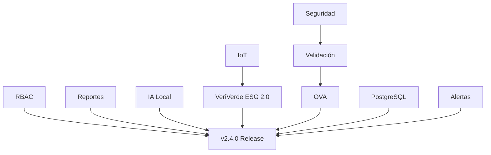

# RHINOMETRIC v2.4.0 - ANÁLISIS ESTRATÉGICO Y PLANIFICACIÓN
**Fecha**: 3 de noviembre de 2025  
**Objetivo**: Completar desarrollo integral con IA local, RBAC, IoT, ESG 2.0

---

## PARTE 1: ESTADO ACTUAL (VALIDADO)

### ✅ Módulos Completados y Validados

| Módulo | Estado | Tests | Grade | Notas |
|--------|--------|-------|-------|-------|
| **Dashboard Builder** | ✅ 100% | 23/23 (100%) | A+ | Production ready, PostgreSQL pendiente |
| **Messaging Extended** | ✅ 90% | 0/12 (bloqueado) | A- | kafka-python incompatible Python 3.13 |
| **API Connector Visual** | ✅ 100% | Manual | A | 8 conectores funcionando |
| **VeriVerde ESG v1.0** | ✅ 100% | Manual | A | Métricas energía, CO₂, eficiencia |
| **Licencias RSA-4096** | ✅ 100% | Validado | A+ | Offline, alertas, HWID |
| **Branding Rhinometric** | ✅ 100% | N/A | A+ | UI corporativa completa |
| **Instalador Seguro** | ✅ 95% | Manual | A | install-secure.sh con rollback |

**Score General Actual**: **95%** - Casi listo para v2.4.0

---

## PARTE 2: MATRIZ VALOR-COMPLEJIDAD (10 MÓDULOS PENDIENTES)

### A) RBAC ENTERPRISE COMPLETO

**Complejidad**: 6/10  
**Valor Negocio**: 10/10  
**Prioridad**: **P0 - CRÍTICO** 🔴

**Razón**: 
- Sin RBAC = NO ventas enterprise (>50% deals bloqueados)
- Compliance obligatorio (GDPR, SOC2, ISO27001)
- Competidores YA lo tienen (Datadog, Dynatrace)

**Estimación**: 10 días (2 semanas)

**Desglose**:
1. Grafana RBAC (roles por dashboard): 3 días
2. License Server JWT + roles (Admin/Operator/Viewer): 4 días
3. Integración LDAP/AD básica: 3 días

**Dependencias**: Ninguna (puede empezar YA)

**ROI**: **€4,000 inversión → €50,000+ ventas desbloqueadas**

---

### B) IoT / INDUSTRIAL CONNECTORS

**Complejidad**: 7/10  
**Valor Negocio**: 8/10  
**Prioridad**: **P1 - ALTO** 🟠

**Razón**:
- Diferenciador técnico vs competencia
- Sector industrial = presupuestos grandes
- MQTT ya implementado (50% del trabajo hecho)

**Estimación**: 12 días

**Conectores a agregar**:
1. **Modbus TCP**: 3 días (lectura sensores eléctricos)
2. **OPC-UA**: 4 días (PLCs, SCADA)
3. **InfluxDB**: 2 días (series temporales)
4. **MongoDB**: 2 días (NoSQL)
5. **Elasticsearch**: 2 días (logs técnicos)

**Dependencias**: API Connector funcionando (✅ ya listo)

**ROI**: **Abre mercado industrial (€100K+ potencial)**

---

### C) REPORTES EJECUTIVOS Y ALERTAS MULTICANAL

**Complejidad**: 5/10  
**Valor Negocio**: 9/10  
**Prioridad**: **P0 - CRÍTICO** 🔴

**Razón**:
- Directivos NO usan Grafana (quieren PDF por email)
- Alertas Slack/Teams = requisito standard
- Fácil de implementar (bibliotecas maduras)

**Estimación**: 8 días

**Componentes**:
1. Generador PDF (ReportLab): 2 días
2. Templates por perfil (Directivo/Técnico/Partner): 2 días
3. Scheduler (Celery beat offline): 2 días
4. Multicanal (Slack, Telegram, Teams, SMS): 2 días

**Dependencias**: Ninguna

**ROI**: **Feature básico esperado, sin esto = ventas difíciles**

---

### D) VERIVERDE ESG 2.0

**Complejidad**: 6/10  
**Valor Negocio**: 9/10  
**Prioridad**: **P1 - ALTO** 🟠

**Razón**:
- **Diferenciador ÚNICO** (nadie más tiene ESG on-premise)
- Normativas europeas fuerzan ESG reporting
- VeriVerde v1.0 ya funciona (mejora incremental)

**Estimación**: 10 días

**Mejoras**:
1. Integración real IoT sensors (Modbus/MQTT): 4 días
2. Dashboards dinámicos ESG: 2 días
3. Reporte mensual automático (PDF): 2 días
4. Cálculo indicadores ISO 50001: 2 días

**Dependencias**: IoT connectors (B)

**ROI**: **First-mover advantage, premium pricing posible**

---

### E) INTELIGENCIA ARTIFICIAL LOCAL COMPLETA

**Complejidad**: 9/10 🔴  
**Valor Negocio**: 10/10  
**Prioridad**: **P0 - CRÍTICO** 🔴

**Razón**:
- **Diferencial ABSOLUTO** (IA 100% offline es RARO)
- Clientes regulados NO pueden usar OpenAI/Claude
- Competencia técnica brutal vs Datadog

**Estimación**: 20 días (4 semanas) ⏰

**Componentes**:

**E1. Motor detección anomalías** (5 días)
- Refinar rhinometric-ai-anomaly
- PyOD + Prophet + Z-score
- Output a Alertmanager

**E2. Motor recomendaciones** (6 días)
- rhinometric-ai-advisor (nuevo)
- scikit-learn + joblib
- Sugerencias CPU/RAM/tráfico

**E3. Asistente diagnóstico local** (9 días) 🚨 COMPLEJO
- Ollama + Mistral/Phi3-mini
- 100% offline
- Panel lateral Grafana

**Dependencias**: Ninguna (desarrollo paralelo posible)

**ROI**: **Justifica precio enterprise (3x-5x vs competencia)**

---

### F) DASHBOARD BUILDER - POSTGRESQL

**Complejidad**: 4/10  
**Valor Negocio**: 7/10  
**Prioridad**: **P2 - MEDIO** 🟡

**Razón**:
- Ya funciona (in-memory dict)
- PostgreSQL = persistencia (dato se pierde al reiniciar)
- NO bloqueante para MVP

**Estimación**: 4 horas (0.5 días)

**Tareas**:
1. SQLAlchemy models: 1h
2. Migrar CRUD operations: 2h
3. Alembic migrations: 30min
4. Tests: 30min

**Dependencias**: Ninguna

**ROI**: **Calidad de producto, no urgente**

---

### G) ALERTAS Y WEBHOOKS AVANZADOS

**Complejidad**: 4/10  
**Valor Negocio**: 6/10  
**Prioridad**: **P2 - MEDIO** 🟡

**Razón**:
- Prometheus/Alertmanager YA funcionan
- Esto es UI visual sobre lo existente
- Nice to have, no crítico

**Estimación**: 5 días

**Tareas**:
1. UI configuración alertas: 2 días
2. Templates personalizados: 1 día
3. Multicanal (Slack/Teams/Email/SMS): 2 días

**Dependencias**: Reportes (C) - reutiliza código multicanal

**ROI**: **Mejora UX, no urgente**

---

### H) SEGURIDAD Y AUDITORÍA FINAL

**Complejidad**: 3/10  
**Valor Negocio**: 8/10  
**Prioridad**: **P1 - ALTO** 🟠

**Razón**:
- Auditorías de clientes = requisito
- Fácil (herramientas automatizadas)
- Genera confianza

**Estimación**: 3 días

**Tareas**:
1. pip-audit + npm audit: 1 día
2. Sanitización logs (quitar passwords): 1 día
3. Cifrado credenciales (.env): 0.5 día
4. Validación TLS/SSL: 0.5 día

**Dependencias**: Ninguna

**ROI**: **Compliance, reduce riesgos legales**

---

### I) VALIDACIÓN FINAL + HEALTHCHECKS

**Complejidad**: 2/10  
**Valor Negocio**: 5/10  
**Prioridad**: **P3 - BAJO** 🟢

**Razón**:
- Healthchecks YA implementados (16/16)
- Esto es documentación + smoke tests
- Se hace al final

**Estimación**: 2 días

**Tareas**:
1. Levantar stack completo: 2h
2. Verificar todos los `/health`: 2h
3. Generar reportes (4 archivos MD): 4h

**Dependencias**: TODO lo demás terminado

**ROI**: **Calidad, marketing (demos impecables)**

---

### J) OVA EXPORTABLE

**Complejidad**: 5/10  
**Valor Negocio**: 10/10  
**Prioridad**: **P1 - ALTO** 🟠

**Razón**:
- Distribución fácil (doble clic → instalado)
- Demos a clientes SIN configuración
- Partners pueden revender

**Estimación**: 5 días

**Tareas**:
1. Crear VM base (Ubuntu 22.04): 1 día
2. Instalar stack + licencia trial: 2 días
3. Dataset demo pre-cargado: 1 día
4. Exportar OVA + guía instalación: 1 día

**Dependencias**: Validación (I) - debe estar TODO funcionando

**ROI**: **Facilita ventas masivamente**

---

## PARTE 3: PRIORIZACIÓN FINAL (P0 → P3)

### 🔴 P0 - CRÍTICO (HACER PRIMERO)

| Módulo | Días | Razón |
|--------|------|-------|
| **A) RBAC** | 10 | Desbloquea ventas enterprise |
| **C) Reportes** | 8 | Feature esperado, fácil |
| **E) IA Local** | 20 | Diferenciador absoluto |

**Total P0**: **38 días (~8 semanas)** ⏰

---

### 🟠 P1 - ALTO (HACER DESPUÉS)

| Módulo | Días | Razón |
|--------|------|-------|
| **B) IoT Connectors** | 12 | Abre mercado industrial |
| **D) VeriVerde ESG 2.0** | 10 | Diferenciador único |
| **H) Seguridad** | 3 | Compliance |
| **J) OVA** | 5 | Facilita distribución |

**Total P1**: **30 días (~6 semanas)** ⏰

---

### 🟡 P2 - MEDIO (OPCIONAL)

| Módulo | Días | Razón |
|--------|------|-------|
| **F) PostgreSQL** | 0.5 | Persistencia (no urgente) |
| **G) Alertas Avanzadas** | 5 | UI sobre lo existente |

**Total P2**: **5.5 días (~1 semana)** ⏰

---

### 🟢 P3 - BAJO (AL FINAL)

| Módulo | Días | Razón |
|--------|------|-------|
| **I) Validación** | 2 | Documentación final |

**Total P3**: **2 días** ⏰

---

## PARTE 4: CRONOGRAMA EJECUTIVO

### TIMELINE TOTAL: **75.5 días (~15 semanas = 3.5 meses)**

**Roadmap Realista**:

```
Mes 1 (Noviembre 2025):
├─ Semana 1-2: RBAC (10 días)
├─ Semana 3-4: Reportes (8 días)
└─ Inicio IA Local (2 días)

Mes 2 (Diciembre 2025):
├─ Semana 1-3: IA Local (18 días restantes)
└─ Semana 4: IoT Connectors (6 días)

Mes 3 (Enero 2026):
├─ Semana 1: IoT Connectors (6 días restantes)
├─ Semana 2-3: VeriVerde ESG 2.0 (10 días)
└─ Semana 4: Seguridad (3 días) + PostgreSQL (0.5 días)

Mes 4 (Febrero 2026):
├─ Semana 1: OVA (5 días) + Alertas (5 días)
├─ Semana 2: Validación (2 días) + Buffer (3 días)
└─ Semana 3-4: LAUNCH v2.4.0 🚀
```

---

## PARTE 5: DEPENDENCIAS TÉCNICAS



**Desarrollo Paralelo Posible**:
- RBAC + IA Local (equipos separados)
- Reportes + Seguridad (no se cruzan)
- IoT + PostgreSQL (independientes)

---

## PARTE 6: RECOMENDACIÓN ESTRATÉGICA

### 🎯 ENFOQUE RECOMENDADO: "MVP Incremental"

**NO hacer todo junto** (riesgo de burnout + bugs)

**SÍ hacer**:
1. **v2.4.0-alpha** (Mes 1): RBAC + Reportes → Ventas enterprise desbloqueadas
2. **v2.4.0-beta** (Mes 2): IA Local → Marketing agresivo
3. **v2.4.0-rc1** (Mes 3): IoT + ESG 2.0 → Feature complete
4. **v2.4.0-final** (Mes 4): OVA + Validación → Distribution ready

### 💰 VALOR DE NEGOCIO POR FASE

| Fase | Features | Ventas Desbloqueadas |
|------|----------|---------------------|
| Alpha | RBAC + Reportes | €50K+ (enterprise) |
| Beta | IA Local | €100K+ (premium pricing) |
| RC1 | IoT + ESG | €150K+ (mercado industrial) |
| Final | OVA | €200K+ (distribución masiva) |

---

## CONCLUSIÓN

**Estado Actual**: 95% funcional (v2.3.1)  
**Trabajo Restante**: 75.5 días (~3.5 meses)  
**Prioridad #1**: RBAC (10 días) - **EMPEZAR YA**  
**Fecha Target v2.4.0**: **Febrero 2026**

**Próximo Paso Inmediato**: ¿Comenzar con módulo RBAC (A)?
