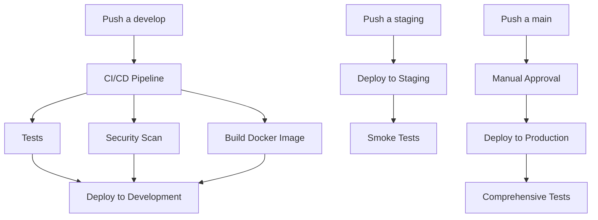

# 🚀 Rhinometric Developer Onboarding Guide

¡Bienvenido al equipo de desarrollo de Rhinometric! Esta guía te ayudará a configurar tu entorno de desarrollo y entender nuestro flujo de trabajo profesional.

## 📋 Tabla de Contenidos

1. [Visión General del Proyecto](#visión-general)
2. [Requisitos del Sistema](#requisitos)
3. [Configuración Inicial](#configuración-inicial)
4. [Estructura del Proyecto](#estructura)
5. [Flujo de Desarrollo](#flujo-desarrollo)
6. [Base de Datos](#base-de-datos)
7. [Testing](#testing)
8. [Deployment](#deployment)
9. [Debugging](#debugging)
10. [Buenas Prácticas](#buenas-prácticas)

## 🌟 Visión General del Proyecto {#visión-general}

### ¿Qué es Rhinometric?

Rhinometric es una plataforma SaaS multi-tenant desarrollada en Node.js que proporciona:

- **API RESTful** con autenticación JWT
- **Base de datos PostgreSQL** con migraciones automáticas
- **Cache Redis** para optimización de rendimiento  
- **Multi-tenancy** con aislamiento de datos por cliente
- **CI/CD automatizado** con GitHub Actions
- **Deployment multi-ambiente** (dev, staging, production)

### Arquitectura Técnica

```
┌─────────────────┐    ┌─────────────────┐    ┌─────────────────┐
│   Frontend      │    │   API Gateway   │    │   Backend API   │
│   (Futuro)      │────▶│   (Nginx)      │────▶│   (Node.js)     │
└─────────────────┘    └─────────────────┘    └─────────────────┘
                                                        │
                        ┌─────────────────┐    ┌─────────────────┐
                        │   Redis Cache   │    │   PostgreSQL    │
                        │   (Sessions)    │    │   (Data)        │
                        └─────────────────┘    └─────────────────┘
```

### Stack Tecnológico

| Componente | Tecnología | Versión |
|------------|------------|---------|
| **Runtime** | Node.js | 16.20.2 |
| **Framework** | Express.js | 4.18+ |
| **Base de Datos** | PostgreSQL | 13+ |
| **Cache** | Redis | 6+ |
| **Containerización** | Docker | 20+ |
| **Orquestación** | Docker Compose | 2+ |
| **CI/CD** | GitHub Actions | - |
| **Cloud** | Oracle Cloud | - |
| **Reverse Proxy** | Nginx | 1.18+ |
| **SSL** | Let's Encrypt | - |

## 🔧 Requisitos del Sistema {#requisitos}

### Software Necesario

#### Desarrollo Local
- **Git** 2.30+
- **Node.js** 16.20.2 (usar nvm/fnm)
- **Docker** 20.10+
- **Docker Compose** 2.0+
- **PostgreSQL Client** (psql)
- **Redis CLI** (redis-cli)

#### Editor Recomendado
- **VS Code** con extensiones:
  - ES7+ React/Redux/React-Native snippets
  - Prettier
  - ESLint
  - Docker
  - REST Client

#### Terminal
- **Bash/Zsh** (Linux/macOS)
- **WSL2** (Windows)

### Verificación de Requisitos

```bash
# Verificar versiones instaladas
node --version     # debe ser 16.20.2
npm --version      # debe ser 8+
docker --version   # debe ser 20+
docker-compose --version # debe ser 2+
git --version      # debe ser 2.30+
psql --version     # debe ser 13+
redis-cli --version # debe ser 6+
```

## 🏗️ Configuración Inicial {#configuración-inicial}

### 1. Clonar Repositorio

```bash
# Clonar el repositorio
git clone https://github.com/Rafael2712/mi-proyecto.git
cd mi-proyecto

# Configurar usuario Git (si es necesario)
git config user.name "Tu Nombre"
git config user.email "tu.email@rhinometric.com"
```

### 2. Configurar Node.js

```bash
# Instalar nvm (si no está instalado)
curl -o- https://raw.githubusercontent.com/nvm-sh/nvm/v0.39.0/install.sh | bash

# Usar versión correcta de Node.js
nvm install 16.20.2
nvm use 16.20.2

# Verificar versión
node --version # debe mostrar v16.20.2
```

### 3. Instalar Dependencias

```bash
# Backend
cd backend
npm install

# Verificar que no hay vulnerabilidades críticas
npm audit

# Instalar herramientas globales (opcional)
npm install -g nodemon typescript
```

### 4. Configurar Variables de Ambiente

```bash
# Copiar template de variables
cp .env.example .env.local

# Editar variables de desarrollo
nano .env.local
```

**Contenido de `.env.local`:**
```bash
# Desarrollo Local
NODE_ENV=development
PORT=3001

# Base de Datos
DB_HOST=localhost
DB_PORT=5433
DB_NAME=rhinometric_dev
DB_USER=rhinometric_user
DB_PASSWORD=dev_password_123

# Redis
REDIS_URL=redis://localhost:6380

# JWT
JWT_SECRET=development-jwt-secret-key-very-long-and-secure

# CORS
CORS_ORIGIN=http://localhost:3000
ALLOWED_ORIGINS=http://localhost:3000,http://localhost:3001

# Logs
LOG_LEVEL=debug
```

### 5. Configurar Base de Datos

```bash
# Iniciar servicios de desarrollo
docker-compose -f docker-compose.dev.yml up -d postgres redis

# Ejecutar migraciones
npm run migrate

# Ejecutar seeds de desarrollo
npm run seed

# Verificar conexión
npm run db:test
```

### 6. Iniciar Desarrollo

```bash
# Iniciar servidor de desarrollo
npm run dev

# En otra terminal, verificar health check
curl http://localhost:3001/api/v1/health
```

## 📁 Estructura del Proyecto {#estructura}

```
mi-proyecto/
├── 📁 backend/                 # API Node.js
│   ├── 📁 src/
│   │   ├── 📁 controllers/     # Controladores de rutas
│   │   ├── 📁 models/          # Modelos de base de datos
│   │   ├── 📁 routes/          # Definición de rutas
│   │   ├── 📁 middleware/      # Middleware personalizado
│   │   ├── 📁 services/        # Lógica de negocio
│   │   ├── 📁 utils/           # Utilidades compartidas
│   │   └── 📄 server.js        # Punto de entrada
│   ├── 📁 migrations/          # Migraciones de BD
│   ├── 📁 seeds/               # Datos de prueba
│   ├── 📁 tests/               # Tests automatizados
│   ├── 📄 package.json         # Dependencias
│   ├── 📄 Dockerfile           # Imagen Docker
│   └── 📄 .env.example         # Template variables
│
├── 📁 frontend/                # Frontend (futuro)
│   └── 📄 README.md
│
├── 📁 infrastructure/          # Scripts de deployment
│   ├── 📄 docker-compose.dev.yml
│   ├── 📄 docker-compose.staging.yml
│   ├── 📄 docker-compose.prod.yml
│   ├── 📄 deploy-multi-env.sh
│   ├── 📄 configure-nginx-domains.sh
│   ├── 📄 oracle-cloud-deploy.sh
│   └── 📄 oracle-dns-helper.sh
│
├── 📁 docs/                    # Documentación
│   ├── 📄 README.md            # Esta guía
│   ├── 📄 api-documentation.md
│   ├── 📄 deployment-guide.md
│   ├── 📄 cloudflare-dns-setup.md
│   ├── 📄 complete-domain-setup-guide.md
│   └── 📄 github-secrets-setup.md
│
└── 📁 .github/workflows/       # CI/CD
    ├── 📄 ci-cd.yml            # Pipeline principal
    ├── 📄 release.yml          # Gestión de releases
    ├── 📄 security.yml         # Escaneo de seguridad
    └── 📄 database.yml         # Operaciones de BD
```

### Archivos Importantes

| Archivo | Propósito |
|---------|-----------|
| `backend/server.js` | Punto de entrada de la API |
| `backend/package.json` | Dependencias y scripts |
| `infrastructure/deploy-multi-env.sh` | Script de deployment |
| `docs/github-secrets-setup.md` | Configuración de secrets |
| `.github/workflows/ci-cd.yml` | Pipeline de CI/CD |

## 🔄 Flujo de Desarrollo {#flujo-desarrollo}

### Git Workflow

Utilizamos **GitFlow** con 3 ramas principales:

```
main (production)     ──●────●────●──▶ Releases estables
                        │    │    │
staging (pre-prod)    ──●────●────●──▶ Testing pre-release
                        │    │    │
develop (development) ──●────●────●──▶ Desarrollo activo
                        │    │    │
feature/nueva-feat    ──●────●────●──▶ Features individuales
```

### 1. Crear Nueva Feature

```bash
# Actualizar develop
git checkout develop
git pull origin develop

# Crear branch de feature
git checkout -b feature/nombre-descriptivo

# Ejemplo: feature/user-authentication
# Ejemplo: feature/add-user-roles
# Ejemplo: fix/database-connection-timeout
```

### 2. Desarrollo

```bash
# Hacer cambios en el código
# Ejecutar tests
npm test

# Verificar linting
npm run lint

# Commit frecuentes con mensajes descriptivos
git add .
git commit -m "feat: add JWT authentication middleware"

# Push a tu branch
git push origin feature/nombre-descriptivo
```

### 3. Pull Request

1. **Crear PR** desde tu feature branch hacia `develop`
2. **Título descriptivo**: `feat: Add user authentication system`
3. **Descripción completa**:
   ```markdown
   ## 📝 Descripción
   Implementa sistema de autenticación JWT para usuarios.
   
   ## 🔧 Cambios
   - [x] Middleware de autenticación JWT
   - [x] Rutas de login/logout
   - [x] Tests unitarios
   - [x] Documentación actualizada
   
   ## 🧪 Testing
   - [x] Tests pasan localmente
   - [x] Health check funciona
   - [x] Postman collection actualizada
   
   ## 📋 Checklist
   - [x] Código revisado
   - [x] Tests añadidos
   - [x] Documentación actualizada
   - [x] No breaking changes
   ```

### 4. Code Review

**Como Autor:**
- ✅ Asegúrate que CI/CD pase
- ✅ Responde comentarios constructivamente
- ✅ Realiza cambios solicitados

**Como Reviewer:**
- 🔍 Revisa lógica y arquitectura
- 🧪 Verifica tests y cobertura
- 📝 Comenta constructivamente
- ✅ Aprueba cuando esté listo

### 5. Merge Strategy

```bash
# Develop → Staging (para testing)
git checkout staging
git merge develop
git push origin staging

# Staging → Main (para production)
git checkout main
git merge staging
git tag v1.0.0
git push origin main --tags
```

### Tipos de Commit

Seguimos [Conventional Commits](https://www.conventionalcommits.org/):

```bash
feat: nueva funcionalidad
fix: corrección de bug
docs: cambios en documentación
style: cambios de formato (no afectan lógica)
refactor: refactoring de código
test: añadir o modificar tests
chore: cambios en build, dependencias, etc.
```

**Ejemplos:**
```bash
git commit -m "feat: add user registration endpoint"
git commit -m "fix: resolve database connection timeout"
git commit -m "docs: update API documentation"
git commit -m "test: add unit tests for auth middleware"
```

## 🗄️ Base de Datos {#base-de-datos}

### Migraciones

```bash
# Crear nueva migración
npm run migration:create -- nombre-descriptiva

# Ejecutar migraciones pendientes
npm run migrate

# Rollback última migración
npm run rollback

# Status de migraciones
npm run migrate:status
```

### Seeds

```bash
# Ejecutar todos los seeds
npm run seed

# Ejecutar seed específico
npm run seed:run -- seed-name

# Crear nuevo seed
npm run seed:create -- nombre-seed
```

### Comandos Útiles

```bash
# Conectar a BD de desarrollo
npm run db:console

# Backup de BD
npm run db:backup

# Restaurar BD
npm run db:restore backup-file.sql

# Reset completo (¡CUIDADO!)
npm run db:reset
```

### Estructura de Migraciones

```javascript
// migrations/001_create_users_table.js
exports.up = function(knex) {
  return knex.schema.createTable('users', function(table) {
    table.uuid('id').primary().defaultTo(knex.raw('uuid_generate_v4()'));
    table.string('email').notNullable().unique();
    table.string('password_hash').notNullable();
    table.string('first_name').notNullable();
    table.string('last_name').notNullable();
    table.timestamp('created_at').defaultTo(knex.fn.now());
    table.timestamp('updated_at').defaultTo(knex.fn.now());
  });
};

exports.down = function(knex) {
  return knex.schema.dropTable('users');
};
```

## 🧪 Testing {#testing}

### Estructura de Tests

```
tests/
├── 📁 unit/              # Tests unitarios
│   ├── controllers/
│   ├── services/
│   └── utils/
├── 📁 integration/       # Tests de integración
│   ├── auth/
│   ├── users/
│   └── health/
└── 📁 e2e/              # Tests end-to-end
    └── api/
```

### Comandos de Testing

```bash
# Ejecutar todos los tests
npm test

# Tests unitarios solamente
npm run test:unit

# Tests de integración
npm run test:integration

# Tests con coverage
npm run test:coverage

# Tests en modo watch
npm run test:watch

# Linter
npm run lint

# Fix automático de linting
npm run lint:fix
```

### Escribir Tests

**Test Unitario:**
```javascript
// tests/unit/services/userService.test.js
const { expect } = require('chai');
const UserService = require('../../../src/services/UserService');

describe('UserService', () => {
  describe('validateEmail', () => {
    it('should return true for valid email', () => {
      const result = UserService.validateEmail('user@example.com');
      expect(result).to.be.true;
    });

    it('should return false for invalid email', () => {
      const result = UserService.validateEmail('invalid-email');
      expect(result).to.be.false;
    });
  });
});
```

**Test de Integración:**
```javascript
// tests/integration/auth/login.test.js
const request = require('supertest');
const app = require('../../../src/app');

describe('POST /api/v1/auth/login', () => {
  it('should login with valid credentials', async () => {
    const response = await request(app)
      .post('/api/v1/auth/login')
      .send({
        email: 'test@example.com',
        password: 'password123'
      });

    expect(response.status).to.equal(200);
    expect(response.body).to.have.property('token');
  });
});
```

## 🚀 Deployment {#deployment}

### Ambientes

| Ambiente | URL | Puerto | Branch | Uso |
|----------|-----|---------|--------|-----|
| **Development** | dev-api.rhinometric.com | 3001 | `develop` | Desarrollo activo |
| **Staging** | staging-api.rhinometric.com | 3002 | `staging` | Testing pre-release |
| **Production** | api.rhinometric.com | 3000 | `main` | Producción |

### Pipeline Automático



### Deployment Manual

```bash
# Desarrollo local
docker-compose -f docker-compose.dev.yml up -d

# Staging
./infrastructure/deploy-multi-env.sh staging

# Production (requiere aprobación)
./infrastructure/deploy-multi-env.sh production
```

### Rollback

```bash
# Rollback automático
./infrastructure/oracle-cloud-deploy.sh production latest true

# Rollback a versión específica
./infrastructure/oracle-cloud-deploy.sh production v1.0.0
```

### Health Checks

```bash
# Local
curl http://localhost:3001/api/v1/health

# Development
curl https://dev-api.rhinometric.com/api/v1/health

# Staging
curl https://staging-api.rhinometric.com/api/v1/health

# Production
curl https://api.rhinometric.com/api/v1/health
```

## 🔍 Debugging {#debugging}

### Logs

```bash
# Ver logs en tiempo real (desarrollo)
npm run dev

# Logs de contenedor Docker
docker logs rhinometric-app-development -f

# Logs de producción
ssh opc@oracle-host
tail -f /var/log/rhinometric/rhinometric-production.log
```

### Debug en VS Code

**Configuración `.vscode/launch.json`:**
```json
{
  "version": "0.2.0",
  "configurations": [
    {
      "name": "Debug Rhinometric API",
      "type": "node",
      "request": "launch",
      "program": "${workspaceFolder}/backend/src/server.js",
      "env": {
        "NODE_ENV": "development",
        "PORT": "3001"
      },
      "console": "integratedTerminal",
      "restart": true,
      "runtimeExecutable": "nodemon"
    }
  ]
}
```

### Herramientas de Debugging

#### Postman Collection
```bash
# Importar collection de Postman
# Archivo: docs/Rhinometric-API.postman_collection.json
```

#### REST Client (VS Code)
```http
### Health Check
GET http://localhost:3001/api/v1/health

### Login
POST http://localhost:3001/api/v1/auth/login
Content-Type: application/json

{
  "email": "test@example.com",
  "password": "password123"
}
```

### Debugging Común

#### 1. Error de Conexión a BD

```bash
# Verificar que PostgreSQL esté ejecutándose
docker ps | grep postgres

# Verificar conexión
psql -h localhost -p 5433 -U rhinometric_user -d rhinometric_dev

# Revisar logs de PostgreSQL
docker logs rhinometric-postgres-development
```

#### 2. Error de Redis

```bash
# Verificar Redis
docker ps | grep redis

# Test de conexión
redis-cli -h localhost -p 6380 ping

# Revisar logs
docker logs rhinometric-redis-development
```

#### 3. Puerto Ocupado

```bash
# Ver qué proceso usa el puerto
lsof -i :3001

# Matar proceso si es necesario
kill -9 <PID>
```

## ✅ Buenas Prácticas {#buenas-prácticas}

### Código

#### ✅ DO (Hacer)

1. **Usar async/await** en lugar de callbacks
```javascript
// ✅ Correcto
async function getUser(id) {
  try {
    const user = await User.findById(id);
    return user;
  } catch (error) {
    logger.error('Error fetching user:', error);
    throw error;
  }
}

// ❌ Incorrecto
function getUser(id, callback) {
  User.findById(id, (err, user) => {
    if (err) return callback(err);
    callback(null, user);
  });
}
```

2. **Validar input del usuario**
```javascript
// ✅ Correcto
const { body, validationResult } = require('express-validator');

const validateLogin = [
  body('email').isEmail().normalizeEmail(),
  body('password').isLength({ min: 8 }),
  (req, res, next) => {
    const errors = validationResult(req);
    if (!errors.isEmpty()) {
      return res.status(400).json({ errors: errors.array() });
    }
    next();
  }
];
```

3. **Usar logging estructurado**
```javascript
// ✅ Correcto
logger.info('User login attempt', { 
  userId: user.id, 
  email: user.email, 
  ip: req.ip 
});

// ❌ Incorrecto
console.log('User logged in: ' + user.email);
```

4. **Manejar errores apropiadamente**
```javascript
// ✅ Correcto
app.use((error, req, res, next) => {
  logger.error('Unhandled error:', error);
  
  if (error.name === 'ValidationError') {
    return res.status(400).json({ error: 'Invalid input data' });
  }
  
  res.status(500).json({ error: 'Internal server error' });
});
```

#### ❌ DON'T (No hacer)

1. **No hardcodear secretos**
```javascript
// ❌ Incorrecto
const JWT_SECRET = 'my-secret-key';

// ✅ Correcto
const JWT_SECRET = process.env.JWT_SECRET;
```

2. **No logear información sensible**
```javascript
// ❌ Incorrecto
logger.info('User data:', { password: user.password });

// ✅ Correcto
logger.info('User data:', { id: user.id, email: user.email });
```

3. **No usar console.log en producción**
```javascript
// ❌ Incorrecto
console.log('Debug info');

// ✅ Correcto
logger.debug('Debug info');
```

### Base de Datos

#### ✅ DO (Hacer)

1. **Usar transacciones para operaciones críticas**
```javascript
const trx = await knex.transaction();
try {
  await trx('users').insert(userData);
  await trx('profiles').insert(profileData);
  await trx.commit();
} catch (error) {
  await trx.rollback();
  throw error;
}
```

2. **Usar índices en columnas consultadas frecuentemente**
```sql
-- En migrations
table.index('email');
table.index(['tenant_id', 'created_at']);
```

3. **Validar foreign keys**
```javascript
table.uuid('user_id')
  .references('id')
  .inTable('users')
  .onDelete('CASCADE');
```

#### ❌ DON'T (No hacer)

1. **No hacer queries en loops**
```javascript
// ❌ Incorrecto
for (const userId of userIds) {
  const user = await User.findById(userId);
}

// ✅ Correcto
const users = await User.whereIn('id', userIds);
```

### Seguridad

#### ✅ DO (Hacer)

1. **Sanitizar y validar todo input**
2. **Usar HTTPS siempre en producción**
3. **Implementar rate limiting**
4. **Mantener dependencias actualizadas**
5. **Usar headers de seguridad**

```javascript
app.use(helmet({
  contentSecurityPolicy: {
    directives: {
      defaultSrc: ["'self'"],
      styleSrc: ["'self'", "'unsafe-inline'"]
    }
  }
}));
```

#### ❌ DON'T (No hacer)

1. **No confiar en validación del frontend únicamente**
2. **No exponer stack traces en producción**
3. **No usar dependencias con vulnerabilidades conocidas**
4. **No logear passwords o tokens**

### Performance

#### ✅ DO (Hacer)

1. **Usar Redis para caching**
```javascript
const cached = await redis.get(`user:${userId}`);
if (cached) return JSON.parse(cached);

const user = await User.findById(userId);
await redis.setex(`user:${userId}`, 300, JSON.stringify(user));
return user;
```

2. **Paginar resultados grandes**
```javascript
const { page = 1, limit = 20 } = req.query;
const offset = (page - 1) * limit;
const users = await User.limit(limit).offset(offset);
```

3. **Usar connection pooling**
```javascript
const pool = new Pool({
  connectionString: process.env.DATABASE_URL,
  max: 20,
  idleTimeoutMillis: 30000,
  connectionTimeoutMillis: 2000,
});
```

## 📚 Recursos Adicionales

### Documentación

- 📖 [API Documentation](api-documentation.md)
- 🚀 [Deployment Guide](deployment-guide.md)
- 🔧 [GitHub Secrets Setup](github-secrets-setup.md)
- 🌐 [Domain Configuration](complete-domain-setup-guide.md)

### Enlaces Útiles

- 🏠 [GitHub Repository](https://github.com/Rafael2712/mi-proyecto)
- 🔗 [Development API](https://dev-api.rhinometric.com)
- 🎭 [Staging API](https://staging-api.rhinometric.com)
- 🌟 [Production API](https://api.rhinometric.com)

### Contacto

- 📧 **Email**: dev@rhinometric.com
- 💬 **Slack**: #rhinometric-dev
- 🐛 **Issues**: GitHub Issues
- 📝 **Docs**: GitHub Wiki

---

## 🎯 Quick Start Checklist

Una vez que hayas leído esta guía, usa este checklist para verificar tu setup:

### Configuración Inicial
- [ ] ✅ Node.js 16.20.2 instalado
- [ ] ✅ Docker y Docker Compose instalados
- [ ] ✅ Repositorio clonado
- [ ] ✅ Dependencias instaladas (`npm install`)
- [ ] ✅ Variables de ambiente configuradas (`.env.local`)

### Base de Datos
- [ ] ✅ PostgreSQL corriendo (`docker-compose up -d postgres`)
- [ ] ✅ Migraciones ejecutadas (`npm run migrate`)
- [ ] ✅ Seeds ejecutados (`npm run seed`)
- [ ] ✅ Conexión verificada (`npm run db:test`)

### Desarrollo
- [ ] ✅ Servidor iniciado (`npm run dev`)
- [ ] ✅ Health check funciona (`curl localhost:3001/api/v1/health`)
- [ ] ✅ Tests pasan (`npm test`)
- [ ] ✅ Linting configurado (`npm run lint`)

### Git Workflow
- [ ] ✅ Usuario Git configurado
- [ ] ✅ Acceso al repositorio confirmado
- [ ] ✅ Branch de feature creado
- [ ] ✅ Primer commit realizado

### Herramientas
- [ ] ✅ VS Code configurado con extensiones
- [ ] ✅ Postman collection importada
- [ ] ✅ Debug configurado

¡Felicidades! 🎉 Estás listo para contribuir a Rhinometric. Si tienes alguna pregunta, no dudes en contactar al equipo de desarrollo.

---

**📅 Última actualización:** Octubre 2025  
**👨‍💻 Autor:** Rhinometric Development Team  
**📝 Versión:** 1.0.0