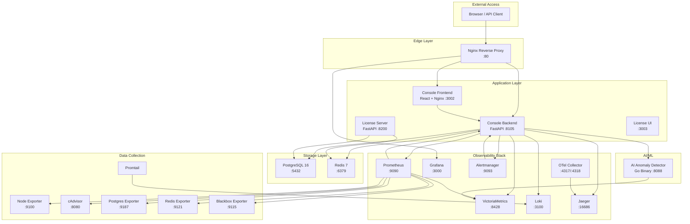
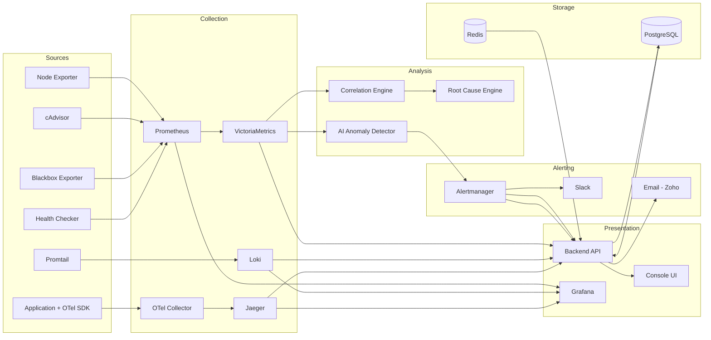

# Rhinometric Platform — Technical Overview

**Version:** 2.7.0  
**Date:** March 2026  
**Classification:** Internal — Confidential  
**Maintained by:** Rhinometric Team — info@rhinometric.com

---

## 1. Architecture Overview

Rhinometric is a containerized observability platform deployed as a single Docker Compose stack with 21 interconnected services. All inter-service communication occurs over a private Docker bridge network (`rhinometric_network`).



---

## 2. Service Inventory

### 2.1 Container Map

| Container | Image | Port | Purpose | Health Check |
|-----------|-------|------|---------|-------------|
| `rhinometric-nginx` | nginx:1.25 | 80 (public) | Reverse proxy, rate limiting, TLS termination | TCP port |
| `rhinometric-console-frontend` | custom | 3002 | React SPA served via Nginx | HTTP /health |
| `rhinometric-console-backend` | custom | 8105 | FastAPI API Gateway | HTTP /health |
| `rhinometric-postgres` | postgres:16 | 5432 | Primary database | pg_isready |
| `rhinometric-redis` | redis:7-alpine | 6379 | Cache, session store | redis-cli ping |
| `rhinometric-prometheus` | prom/prometheus | 9090 | Metrics scraping & short-term storage | HTTP /-/healthy |
| `rhinometric-victoria-metrics` | victoriametrics | 8428 | Long-term metrics storage | HTTP /health |
| `rhinometric-loki` | grafana/loki | 3100 | Log aggregation | HTTP /ready |
| `rhinometric-jaeger` | jaegertracing/all-in-one | 16686 | Distributed tracing | HTTP / |
| `rhinometric-grafana` | grafana/grafana | 3000 | Dashboard visualization | HTTP /api/health |
| `rhinometric-alertmanager` | prom/alertmanager | 9093 | Alert routing & grouping | HTTP /-/healthy |
| `rhinometric-otel-collector` | otel/opentelemetry-collector | 4317/4318 | Telemetry reception | HTTP /health |
| `rhinometric-node-exporter` | prom/node-exporter | 9100 | Host metrics | — |
| `rhinometric-cadvisor` | gcr.io/cadvisor | 8080 | Container metrics | HTTP /healthz |
| `rhinometric-postgres-exporter` | prometheuscommunity/postgres-exporter | 9187 | PostgreSQL metrics | HTTP / |
| `rhinometric-redis-exporter` | oliver006/redis_exporter | 9121 | Redis metrics | — |
| `rhinometric-blackbox-exporter` | prom/blackbox-exporter | 9115 | External endpoint probing | — |
| `rhinometric-promtail` | grafana/promtail | — | Log shipping | — |
| `rhinometric-ai-anomaly` | custom (Go) | 8088 | ML anomaly detection | HTTP /health |
| `rhinometric-license-server-v2` | custom | 8200 | License management | HTTP /health |
| `rhinometric-license-ui` | custom | 3003 | License activation UI | HTTP / |

### 2.2 Network Architecture

All containers join `rhinometric_network` (bridge driver). Only port 80 (Nginx) is exposed externally. All other services communicate internally via Docker DNS.

```
External → :80 (Nginx)
                ├── / → Frontend (:3002)
                ├── /api/ → Backend (:8105)
                ├── /grafana/ → Grafana (:3000)
                └── /admin/grafana/ → Grafana (with Basic Auth)
```

---

## 3. Backend Architecture

### 3.1 Framework

- **FastAPI** (Python 3.11) with Uvicorn ASGI server
- **SQLAlchemy 2.0** ORM with PostgreSQL
- **Alembic** for database migrations
- **python-jose** for JWT authentication
- **httpx** for async HTTP calls to observability services

### 3.2 Router Map

| Router | Prefix | Auth | Description |
|--------|--------|------|-------------|
| `auth` | `/api/auth` | Public (login) / JWT | Authentication, user profile, password management |
| `anomalies` | `/api/anomalies` | JWT | Anomaly groups, status updates, AI service proxy |
| `alerts` | `/api/alerts` | JWT | Active alerts from Alertmanager |
| `alert_rules` | `/api/alert-rules` | JWT | Alert rule CRUD |
| `alert_history` | `/api/alert-history` | JWT | Historical alert records |
| `incidents` | `/api/incidents` | JWT | Incident lifecycle, timeline, comments, tags |
| `external_services` | `/api/external-services` | JWT | Service inventory & monitoring |
| `correlation` | `/api/correlation` | JWT | Anomaly correlation engine |
| `service_map` | `/api/service-map` | JWT | Topology & dependencies |
| `slo` | `/api/slo` | JWT | SLO/SLA definitions & compliance |
| `logs` | `/api/logs` | JWT | Loki log queries |
| `traces` | `/api/traces` | JWT | Jaeger trace search |
| `users` | `/api/users` | JWT + ADMIN | User management |
| `settings` | `/api/settings` | JWT | Platform config, notification channels |
| `license` | `/api/license` | JWT | License validation |
| `dashboards` | `/api/dashboards` | JWT | Grafana dashboard list |
| `kpis` | `/api/kpis` | JWT | Home dashboard KPIs |
| `system` | `/api/system` | JWT | System health, version |
| `grafana_proxy` | `/api/grafana-proxy` | JWT | Grafana API pass-through |

### 3.3 Service Layer

| Service | File | Purpose |
|---------|------|---------|
| `ai_analyzer` | `services/ai_analyzer.py` | MAD-based anomaly detection for internal services |
| `alertmanager_template` | `services/alertmanager_template.py` | Renders alertmanager.yml from config |
| `audit_logger` | `services/audit_logger.py` | RBAC audit trail |
| `config_validation` | `services/config_validation.py` | Configuration validators |
| `connector_service` | `services/connector_service.py` | External service connectivity |
| `correlation_engine` | `services/correlation_engine.py` | Time-series correlation (Pearson) |
| `email_service` | `services/email_service.py` | Zoho SMTP email delivery |
| `health_checker` | `services/health_checker.py` | Periodic service health checks |
| `license_validator` | `services/license_validator.py` | License key verification |
| `retention_cleanup` | `services/retention_cleanup.py` | Data retention enforcement |
| `root_cause_engine` | `services/root_cause_engine.py` | Root cause hypothesis generation |
| `state_repository` | `services/state_repository.py` | Application state management |

### 3.4 Database Schema (Key Tables)

| Table | Purpose |
|-------|---------|
| `users` | User accounts with roles |
| `external_services` | Service registry |
| `external_service_checks` | Health check results |
| `service_dependencies` | Topology edges |
| `service_configs` | Service-specific configuration |
| `alert_events` | Alert webhook logs |
| `alert_rules` | Alert rule definitions |
| `alert_history` | Alert state transitions |
| `alert_acknowledgements` | Alert ACK records |
| `incidents` | Incident records |
| `incident_events` | Timeline events |
| `incident_comments` | User comments |
| `licenses` | License records |
| `password_resets` | Password reset tokens |
| `roles` | Role definitions |

---

## 4. Frontend Architecture

### 4.1 Stack

- **React 18.3** + TypeScript 5.6
- **Vite 5.4** build tool
- **Tailwind CSS** with custom dark theme
- **TanStack Query** (React Query) for data fetching
- **Zustand** for state management (auth store)
- **React Router v6** with protected routes
- **Lucide React** for icons

### 4.2 Page Map

| Page | Route | Description |
|------|-------|-------------|
| Login | `/login` | JWT authentication |
| Home | `/` | Executive KPI dashboard |
| Services | `/services` | Service inventory & health |
| Anomalies | `/anomalies` | AI anomaly groups with deep link support |
| AI Insights | `/ai-insights` | Anomaly analysis |
| Alerts | `/alerts` | Active alerts |
| Alert Rules | `/alert-rules` | Rule management |
| Alert History | `/alert-history` | Historical alerts |
| Incidents | `/incidents` | Incident management |
| Service Map | `/service-map` | Topology visualization |
| SLO | `/slo` | SLO/SLA tracking |
| Correlation | `/correlation/:fingerprint` | Anomaly correlation detail |
| Logs | `/logs` | Log explorer |
| Traces | `/traces` | Trace search |
| Dashboards | `/dashboards` | Grafana dashboard list |
| Dashboard Viewer | `/dashboards/:uid` | Embedded Grafana dashboard |
| Settings | `/settings` | Platform configuration |
| Users | `/users` | User management |
| License | `/license` | License status |
| Roadmap | `/roadmap` | Product roadmap |
| System Health | `/system-health` | Infrastructure health |

---

## 5. AI Anomaly Detection Service

### 5.1 Architecture

- **Language:** Go (compiled binary)
- **Port:** 8088
- **Check interval:** 300 seconds (5 minutes)
- **Data source:** VictoriaMetrics (PromQL queries)

### 5.2 Detection Models

| Model | Algorithm | Purpose |
|-------|-----------|---------|
| Isolation Forest | Unsupervised ML | Detects outliers in multivariate space |
| Local Outlier Factor (LOF) | Density-based | Detects local density anomalies |
| Statistical (MAD) | Modified Z-score | Robust statistical outlier detection |

### 5.3 Metrics Monitored

**Infrastructure:**
- `node_cpu_usage` — CPU utilization
- `node_memory_usage` — Memory utilization
- `node_disk_usage` — Disk utilization
- `node_disk_io` — Disk I/O time
- `node_network_receive` — Network inbound rate
- `node_network_transmit` — Network outbound rate

**Services:**
- `external_service_latency` — Response time per service
- `external_service_health` — Health score per service
- `external_service_availability` — Uptime per service

### 5.4 Alerting Integration

```
AI Detector → Alertmanager (POST /api/v2/alerts)
                    │
                    ├── group_by: [metric, entity_name, severity]
                    ├── group_wait: 30s
                    ├── group_interval: 1h
                    ├── repeat_interval: 4h
                    └── resolve_timeout: 10m
                    │
                    ├── Slack webhook
                    └── Backend webhook → Email (with cooldown)
```

---

## 6. Data Flow



---

## 7. Security Architecture

### 7.1 Authentication

- JWT tokens (HS256) with 24-hour expiry
- Password hashing with bcrypt
- Forced password change on first login
- 401 detection in frontend with automatic logout/redirect

### 7.2 Authorization

- Four roles: `OWNER` > `ADMIN` > `OPERATOR` > `VIEWER`
- Role-based route protection on backend
- Audit logging for sensitive operations

### 7.3 Network Security

- Only port 80 exposed externally (Nginx)
- All internal services on private Docker network
- Rate limiting on API endpoints (30 req/s)
- Stricter rate limiting on auth endpoints (5 req/min)
- Security headers: X-Frame-Options, X-Content-Type-Options, X-XSS-Protection

### 7.4 Grafana Access

- Public embed: auto-signed as `admin` via `X-WEBAUTH-USER` header
- Admin access: Basic Auth + Grafana login required

---

## 8. Operational Considerations

### 8.1 Resource Requirements

| Resource | Minimum | Recommended |
|----------|---------|-------------|
| CPU | 4 vCPU | 8 vCPU |
| RAM | 8 GB | 16 GB |
| Disk | 50 GB SSD | 200 GB SSD |
| OS | Ubuntu 22.04+ | Ubuntu 24.04 |

### 8.2 Data Retention

| Data Type | Default Retention |
|-----------|------------------|
| Prometheus metrics | 15 days |
| VictoriaMetrics | 90 days |
| Loki logs | 30 days |
| Jaeger traces | 7 days |
| PostgreSQL records | Indefinite (with cleanup service) |

### 8.3 Monitoring of Rhinometric

The platform monitors itself:
- Backend exposes `/metrics` endpoint (Prometheus format)
- cAdvisor monitors all container resource usage
- Node Exporter monitors host system
- Health checks on all containers via Docker healthcheck

---

## 9. Technical Risks & Debt

1. **Single-node architecture:** No horizontal scaling, no HA. Single point of failure.
2. **Grafana dependency:** Dashboards rely on embedded Grafana; no native dashboard builder.
3. **Go binary opacity:** AI anomaly detector is a compiled Go binary without source in container.
4. **No database migrations:** Schema changes require manual SQL or recreating containers.
5. **SMTP coupling:** Email delivery depends on Zoho SMTP; no fallback provider.
6. **Secret management:** Environment variables in `.env` file; no vault integration.
7. **No CI/CD pipeline:** Deployment is manual `docker compose` commands.
8. **Alertmanager config sync:** Changes via API rebuild the YAML; no version control of runtime config.

---

*Document generated by Rhinometric Team — info@rhinometric.com*  
*Last updated: March 2026*
