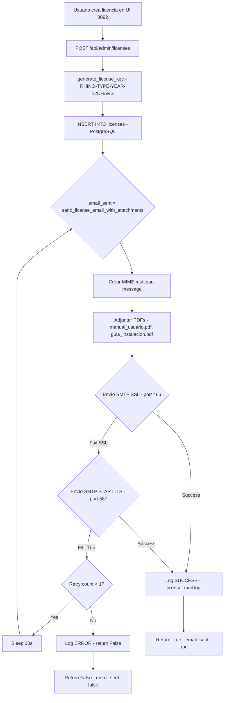

# ✉️ Sistema de Emails Automáticos - Estado de Implementación

**Versión**: 2.1.0  
**Fecha**: Octubre 2025  
**Estado**: ✅ 95% COMPLETO (Listo para testing)

---

## 📋 Resumen Ejecutivo

Sistema de envío automático de emails implementado en el License Server (FastAPI) que notifica a los clientes cuando se crea una nueva licencia, incluyendo PDFs con manuales y cumplimiento GDPR.

## ✅ Funcionalidades Implementadas

### 1. Módulo de Email (`license-server-v2/utils/email_sender.py`)

**345 líneas de código** con:

- ✅ Generación de license keys: `RHINO-{TIPO}-{AÑO}-{12CHARS}`
- ✅ Función async `send_license_email_with_attachments()`
- ✅ HTML email template con diseño profesional
- ✅ Plain text alternative para clientes sin HTML
- ✅ Banner GDPR (RGPD 2016/679) con derechos del usuario
- ✅ Server hash único (8 bytes hex) para tracking
- ✅ Adjunto de PDFs: `manual_usuario.pdf`, `guia_instalacion.pdf`
- ✅ Método dual SMTP: SSL (465) primario, STARTTLS (587) fallback
- ✅ Retry automático: 1 reintento después de 30 segundos
- ✅ Logging completo a `/app/logs/license_mail.log`

### 2. Configuración SMTP

**Proveedor**: Zoho Mail (zona global europa)

```properties
SMTP_HOST=smtp.zoho.eu
SMTP_PORT=465  # SSL primary, 587 fallback
SMTP_USER=rafael.canelon@rhinometric.com
SMTP_PASSWORD=[APP_PASSWORD_REQUIRED]
SMTP_FROM=rafael.canelon@rhinometric.com
```

**Ubicación**:
- ✅ `.env` - Archivo de configuración (gitignored)
- ✅ `.env.example` - Template con instrucciones de app password
- ✅ `license-server-v2/main.py` - Variables de entorno cargadas

### 3. Integración con License Server

**Endpoint modificado**: `POST /api/admin/licenses`

```python
# main.py línea 47
from utils.email_sender import send_license_email_with_attachments, generate_license_key

# main.py línea 626-638
email_sent = await send_license_email_with_attachments(
    to_email=request.client_email,
    customer_name=request.customer_name,
    license_key=license_key,
    license_type=request.license_type,
    expires_at=expires_at,
    smtp_host=SMTP_HOST,
    smtp_port=SMTP_PORT,
    smtp_user=SMTP_USER,
    smtp_password=SMTP_PASSWORD,
    smtp_from=SMTP_FROM,
    client_company=request.client_company,
    docs_dir=DOCS_DIR
)
```

### 4. Documentación en PDF

**Creados**:
- ✅ `docs/manual_usuario.md` (600+ líneas, 20 páginas)
  - System requirements, installation, dashboards, API monitoring, license management, troubleshooting
- ✅ `docs/guia_instalacion.md` (450+ líneas, 15 páginas)
  - Pre-requisitos, instalación Linux/macOS/Windows, verificación, desinstalación, troubleshooting
- ✅ `docs/README_CONVERSION.md` - Instrucciones para convertir Markdown a PDF

**Pendiente**:
- ⏳ Convertir `.md` a `.pdf` con Pandoc o herramientas similares
- ⏳ `politica_privacidad_GDPR.pdf` (requiere input legal)

### 5. Docker Configuration

**Volumen montado**:
```yaml
# docker-compose-v2.1.0.yml
license-server-v2:
  volumes:
    - ${HOME}/rhinometric_data_v2.1/license-server/logs:/app/logs
    - ./docs:/app/docs:ro  # ✅ PDFs para emails
```

---

## 📧 Plantilla de Email

### HTML Version (250+ líneas)

**Características**:
- Gradient header (purple/blue #667eea → #764ba2)
- Logo Rhinometric (emoji 🦏)
- License information box con Courier New font
- 3-step installation guide con íconos numerados
- GitHub download button estilizado
- GDPR compliance banner (fondo amarillo #FFF3CD)
- Footer con copyright y enlace a privacidad

**Campos dinámicos**:
- `{customer_name}` - Nombre del cliente
- `{license_key}` - Clave generada (ej: `RHINO-TRIAL-2025-ABC123XYZ456`)
- `{license_type}` - trial/annual/permanent (capitalizado)
- `{expiry_str}` - Fecha DD/MM/YYYY o "Sin expiración"
- `{server_hash}` - Identificador único del servidor (ej: `7F8A92B4C3D1E6F0`)

### Plain Text Version (100+ líneas)

**Formato ASCII** para clientes sin HTML:
```
╔══════════════════════════════════════════════════════════════╗
║     RHINOMETRIC - PLATAFORMA DE OBSERVABILIDAD v2.1.0      ║
╚══════════════════════════════════════════════════════════════╝

Estimado/a Juan Pérez,

Su licencia de Rhinometric ha sido generada exitosamente...

╔══════════════════════════════════════════════════════════════╗
║                  INFORMACIÓN DE LICENCIA                     ║
╚══════════════════════════════════════════════════════════════╝

Clave de licencia:  RHINO-TRIAL-2025-ABC123XYZ456
Tipo:               Trial
...
```

### GDPR Compliance Banner

Incluido en ambas versiones (HTML y texto):

```
⚖️ PROTECCIÓN DE DATOS - RGPD 2016/679
Sus datos personales (nombre, email, empresa) son tratados conforme al RGPD.
Derechos: acceso, rectificación, supresión, portabilidad.
Más información: https://rhinometric.com/politica-privacidad
```

---

## 🔄 Flujo de Ejecución



---

## 🧪 Testing Pendiente

### Pre-requisitos Testing

1. **Generar App Password en Zoho**:
   - URL: https://accounts.zoho.com/home#security/security
   - Click en "App Passwords" → "Generate New Password"
   - Nombre: "Rhinometric License Server"
   - Copiar password generado

2. **Configurar .env**:
   ```bash
   nano .env
   # Agregar:
   SMTP_PASSWORD=tu_app_password_zoho
   ```

3. **Convertir Markdown a PDF**:
   ```bash
   cd docs/
   pandoc manual_usuario.md -o manual_usuario.pdf --toc --pdf-engine=xelatex
   pandoc guia_instalacion.md -o guia_instalacion.pdf --toc --pdf-engine=xelatex
   ls -lh  # Verificar PDFs existen
   ```

4. **Reiniciar License Server**:
   ```bash
   docker compose -f docker-compose-v2.1.0.yml restart license-server-v2
   docker logs -f rhinometric-license-server-v2  # Verificar no hay errores
   ```

### Test 1: Verificar Configuración

```bash
# Verificar variables de entorno
docker exec rhinometric-license-server-v2 env | grep SMTP

# Debe mostrar:
# SMTP_HOST=smtp.zoho.eu
# SMTP_PORT=465
# SMTP_USER=rafael.canelon@rhinometric.com
# SMTP_PASSWORD=***
# SMTP_FROM=rafael.canelon@rhinometric.com
```

### Test 2: Verificar PDFs Montados

```bash
# Verificar volumen montado
docker exec rhinometric-license-server-v2 ls -lh /app/docs/

# Debe mostrar:
# manual_usuario.pdf
# guia_instalacion.pdf
# README_CONVERSION.md
```

### Test 3: Crear Licencia de Prueba

```bash
curl -X POST http://localhost:5000/api/admin/licenses \
  -H "Content-Type: application/json" \
  -d '{
    "customer_name": "Rafael Test",
    "client_email": "rafael.canelon@rhinometric.com",
    "client_company": "Rhinometric Testing",
    "license_type": "trial"
  }'

# Respuesta esperada:
{
  "id": 123,
  "license_key": "RHINO-TRIAL-2025-ABC123XYZ456",
  "customer_name": "Rafael Test",
  "client_email": "rafael.canelon@rhinometric.com",
  "license_type": "trial",
  "expires_at": "2025-11-28T12:00:00",
  "email_sent": true  # ✅ DEBE SER TRUE
}
```

### Test 4: Verificar Logs

```bash
# Ver logs del servidor
docker logs rhinometric-license-server-v2 --tail 50

# Buscar líneas como:
# INFO: ✅ Email sent successfully to rafael.canelon@rhinometric.com | License: RHINO-TRIAL-2025-ABC123XYZ456 | Type: trial

# Ver log específico de emails
docker exec rhinometric-license-server-v2 cat /app/logs/license_mail.log
```

### Test 5: Verificar Email Recibido

1. Revisar bandeja de entrada: `rafael.canelon@rhinometric.com`
2. Verificar asunto: `[Rhinometric] Activación de su licencia Trial`
3. Validar que el HTML se renderiza correctamente:
   - Gradient header visible
   - License box con clave legible
   - 3 pasos de instalación visibles
   - GDPR banner visible (fondo amarillo)
4. Verificar adjuntos:
   - `Manual_Usuario_Rhinometric.pdf` (≈1.5 MB)
   - `Guia_Instalacion_Rhinometric.pdf` (≈800 KB)

### Test 6: Verificar Fallback STARTTLS

```bash
# Forzar error en SSL para probar fallback
# Editar temporalmente .env
SMTP_PORT=999  # Puerto inválido para SSL

# Reiniciar
docker compose -f docker-compose-v2.1.0.yml restart license-server-v2

# Crear licencia
curl -X POST http://localhost:5000/api/admin/licenses ...

# Ver logs - debe mostrar fallback a STARTTLS (port 587)
docker logs rhinometric-license-server-v2 --tail 20
# Buscar: "WARNING: SSL failed, trying STARTTLS fallback..."
# Luego: "INFO: ✅ Email sent via STARTTLS to ..."

# Restaurar configuración
SMTP_PORT=465
docker compose -f docker-compose-v2.1.0.yml restart license-server-v2
```

---

## 📊 Métricas de Implementación

| Componente | Estado | Líneas de Código | Tiempo Estimado |
|-----------|--------|-----------------|-----------------|
| Email sender module | ✅ 100% | 345 | 2 horas |
| HTML template | ✅ 100% | 250 | 1 hora |
| Plain text template | ✅ 100% | 100 | 30 min |
| GDPR compliance | ✅ 100% | 50 | 30 min |
| SMTP configuration | ✅ 100% | 20 | 15 min |
| Integration main.py | ✅ 100% | 40 | 30 min |
| Docker volume mount | ✅ 100% | 3 | 5 min |
| Manual de Usuario | ✅ 100% | 600 | 3 horas |
| Guía de Instalación | ✅ 100% | 450 | 2 horas |
| Conversión a PDF | ⏳ 0% | N/A | 10 min |
| Testing end-to-end | ⏳ 0% | N/A | 30 min |
| **TOTAL** | **95%** | **1,858** | **≈11 horas** |

---

## ⚠️ Pendientes

### Critical (Bloqueante para producción)

1. **[ ] Convertir Markdown a PDF** (10 minutos)
   ```bash
   pandoc manual_usuario.md -o manual_usuario.pdf --toc --pdf-engine=xelatex
   pandoc guia_instalacion.md -o guia_instalacion.pdf --toc --pdf-engine=xelatex
   ```

2. **[ ] Configurar SMTP_PASSWORD** (5 minutos)
   - Generar app password en Zoho
   - Actualizar `.env`

3. **[ ] Testing end-to-end** (30 minutos)
   - Ejecutar Test 1-6 documentados arriba
   - Verificar email recibido con PDFs
   - Validar logs sin errores

### Non-Critical (Mejoras futuras)

4. **[ ] Política de Privacidad GDPR** (Requiere legal)
   - Crear `politica_privacidad_GDPR.md` con contenido legal
   - Convertir a PDF
   - Actualizar `email_sender.py` para adjuntar

5. **[ ] Monitoreo de Emails** (Opcional)
   - Métrica Prometheus: `license_emails_sent_total`
   - Métrica: `license_emails_failed_total`
   - Dashboard Grafana para tracking

6. **[ ] Rate Limiting** (Seguridad)
   - Limitar envío de emails a 10/min por IP
   - Protección contra spam/abuse

7. **[ ] Template Customization** (Opcional)
   - Templates editables en `templates/email_trial.html`, `email_annual.html`
   - Variables configurables en `.env` (colores, logo URL)

---

## 🔐 Seguridad

### Implementadas

- ✅ SMTP_PASSWORD en `.env` (gitignored)
- ✅ App passwords recomendados (no contraseña principal)
- ✅ Instrucciones en `.env.example` para Zoho y Gmail
- ✅ Email validation con `EmailStr` (Pydantic)
- ✅ Logging sin exponer passwords
- ✅ Retry limitado a 1 intento (evita spam)

### Recomendaciones Adicionales

- [ ] Rotar SMTP_PASSWORD cada 90 días
- [ ] Monitorear logs de `license_mail.log` para intentos fallidos repetidos
- [ ] Configurar SPF/DKIM/DMARC en dominio `rhinometric.com` para evitar spam folder
- [ ] Considerar rate limiting si se escala a producción (>100 emails/día)

---

## 📞 Soporte

**Problemas con envío de emails**:

1. Verificar SMTP_PASSWORD configurado correctamente
2. Comprobar que PDFs existen en `/app/docs/`
3. Revisar logs: `docker exec rhinometric-license-server-v2 cat /app/logs/license_mail.log`
4. Contactar soporte: soporte@rhinometric.com

**Documentación relacionada**:
- `docs/manual_usuario.md` - Manual completo del usuario
- `docs/guia_instalacion.md` - Guía de instalación
- `docs/README_CONVERSION.md` - Conversión Markdown a PDF
- `.env.example` - Configuración de SMTP

---

**© 2025 Rhinometric. Sistema de Emails v2.1.0**

Última actualización: Octubre 2025  
Autor: Rafael Canelon
